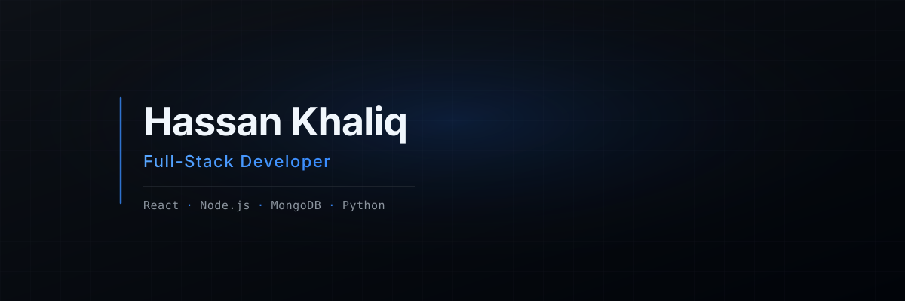

<p align="center">
  
</p>

# Hi, I'm Hassan Khaliq 👋

### Full-Stack Developer

I build modern web applications, SaaS platforms, interactive dashboards,
and creative digital experiences.

My current focus is **React, JavaScript, Node.js, Express, and MongoDB**.
I'm also expanding into **Python and backend engineering**, with a long-term
focus on **Machine Learning and AI**.

I enjoy turning ideas into production-ready applications with clean
interfaces, practical architecture, and meaningful functionality.

## 🚀 What I Build

- Full-stack web applications
- SaaS platforms
- Admin dashboards
- REST APIs
- Interactive React applications
- Business management systems
- AI-powered applications

---

## 🛠 Tech Stack

### Frontend
<p>
  
</p>

### Animation & Creative Development
<p>
  
</p>

### Backend
<p>
  
</p>

### Database
<p>
  
</p>

### Tools & Services
<p>
  
</p>

### Currently Learning
<p>
  
</p>

## 🚀 Featured Projects

### SwissEmbro SaaS
A full-stack SaaS platform for managing embroidery and patch orders,
customers, employees, and administration.

**React · Node.js · Express · MongoDB · Socket.io**

### LI Agent
An AI-powered platform focused on LinkedIn lead generation and
intelligent workflow management.

**React · AI · APIs · Backend**

### E-commerce Profit Dashboard
A dashboard for tracking revenue, expenses, product costs, and
business profitability.

**React · JavaScript · Data Visualization**

### MetaTrybe
A modern digital agency platform focused on interactive design,
motion, and web development.

**React · Vite · GSAP · Modern UI**

---

## 📚 Currently Learning

- Python
- Backend architecture
- Django
- Machine Learning
- Deep Learning

---

## 🎯 My Development Journey

```text
HTML / CSS / JavaScript
          ↓
        React
          ↓
    Full-Stack / MERN
          ↓
Python / Backend
          ↓
Django
          ↓
Machine Learning
          ↓
Deep Learning / AI
